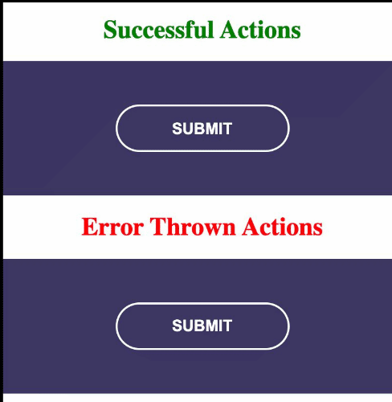

# NGXS loading Plugin


<p align="center">
  
  <a href="https://twitter.com/__bangash"></a>
</p>

The plugin is created for adding action (dispatch, complete, error) status to UI elements such as the submit button [NGXS](https://www.npmjs.com/package/@ngxs/store).


## Reasons to Use This Plugin

 Most of the time we are importing so many things to show loader, disable the Ui element and  like the common one is creating a boolean state in component 
to check for action status, due to this plugin, we can easily handle by using [angular custom directive](https://angular.io/guide/attribute-directives), we can do the following things:

- watch action.
- watch state(like creating a boolean flag in-state).
- can directly dispatch and watch the action.

>We adding `CSS` class to the UI element to define the status of the action.
 * on action dispatch we adding `active` class.
 * on action success we adding `success` class.
 * on action throw error we adding `error` class.

### Disable the UI element.
when action is dispatch the UI element is disabled so plugin prevents a double click on the UI element and enables once action status becomes success or error..

 ***Node***: you need to adding CSS against these classes.

## Installation

Run the following code in your terminal:

```
yarn add ngxs-loading-plugin
```

or if you are using npm:

```
npm install ngxs-loading-plugin
```

## Usage

### Setup Before Initial Use

Import `NgxsLoadingPluginModule` into your root module like:

```TS
import { NgxsModule } from '@ngxs/store';
import { NgxsLoadingPluginModule } from 'ngxs-reset-plugin';

@NgModule({
  imports: [
    NgxsModule.forRoot([ /* Your states here */ ]),
    NgxsLoadingPluginModule.forRoot()
  ]
})
export class AppModule {}
```

loading.actions.ts
```TS
export class FetchingBooksAction {
  static readonly type = '[loading] fetching Books';
}

export class FetchingTeachersAction {
  static readonly type = '[loading] fetcing teachers';
}
```

loading.component.ts
```TS
@Component({
  selector: 'loading',
  templateUrl: './loading.component.html',
  styleUrls: ['./loading.component.css']
})
export class LoadingComponent implements OnInit {
  fechingBookAction = new FetchingBooksAction();
  fetchingTeacherAction = new FetchingTeachersAction();
  constructor(private store: Store) {}

  ngOnInit() {}

  fetchingBooks() {
    this.store.dispatch(this.fechingBookAction);
  }

  fetchingTeachers() {
    this.store.dispatch(this.fetchingTeacherAction);
  }
}
```

### Watch state.

using `ngxsStateWatchLoading` directive and pass the path as string.

```html
<button type="button" ngxsStateWatchLoading="loading.loadingBooks" (click)="fetchingBooks()">Submit</button>
```

> **Important Note**: here we just adding two CSS class `active` ( when the state becomes true) and `success` (when the state becomes false) because of boolean nature. we will try to move it to three states like 
* 0  => `active`.
* 1  => `success`.
* -1 => `error`.


### Watch the action

just passing the instance of action to `[ngxsActionWatchLoading]` directive.
```html
<button type="button" [ngxsActionWatchLoading]="fechingBookAction" (click)="fetchingBooks()">Submit</button>
```
or passing action type as a string `ngxsActionWatchLoading="[loading] fetching Books"`.
```html
<button type="button" ngxsActionWatchLoading="[loading] fetching Books" (click)="fetchingBooks()">Submit</button>
```

### Watch and dispatch the action.

just passing action instanse `[ngxsDispatchLoading]="fetchingTeacherAction"`.
```html
<button type="button [ngxsDispatchLoading]="fetchingTeacherAction">Submit</button>

```
or passing action as the string `ngxsStateWatchLoading="loading.loadingTeacher"`

```html
<button type="button" ngxsStateWatchLoading="loading.loadingTeacher" (click)="fetchingTeachers()">Submit</button>
```



